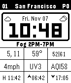
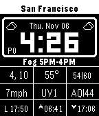

# FitzFace

A high-density, data-rich watchface for the Pebble 2 Duo (B&W, 144x168), featuring weather, environmental data, tide information, and real-time SF MUNI bus tracking.

<table>
  <tr>
    <td></td>
    <td></td>
  </tr>
  <tr>
    <td align="center"><b>Normal Theme</b></td>
    <td align="center"><b>Inverted Theme</b></td>
  </tr>
</table>

## Features

- **City Name Display**: Shows your current location name via GPS reverse geocoding
- **Large, Clear Time Display**: Digital time with date in center of screen
- **Weather & Health Alerts**: Dynamic alert box for unusual conditions with vibration notifications
  - Weather: Rain ≥30%, wind gusts ≥20mph, fog, snow, thunderstorms, freezing conditions
  - Health: High UV (≥8), Extreme UV (≥11), High AQI (≥100), Unhealthy AQI (≥150), High Pollen (≥4)
  - Shows time ranges (e.g., "Heavy Rain 3PM-6PM", "High UV 11AM-3PM", "High Tree Pollen")
  - Vibrates once when new alert detected
- **MUNI Bus Countdown**: Real-time SF MUNI bus arrivals (via 511.org API)
  - Shows next 2 bus arrival times in minutes (e.g., "3, 12")
  - Countdown updates every minute on watch for accurate timing
  - Stores 6 bus arrival timestamps to cover 30-minute sync window
  - Extrapolates additional arrivals from bus interval when API returns fewer predictions
  - Configurable route, stop, and direction
  - Syncs with API every 30 minutes alongside weather data
- **Weather Icons**: Current conditions + tomorrow's forecast icons
- **Temperature Data**: Current, low, and high with visual indicators
- **Wind & Environmental**: Wind speed, UV Index, Air Quality Index (AQI)
- **Pollen Tracking**: Tree, grass, and weed pollen levels (0-5 scale) with type indicator
- **Tide Information**: Next high/low tide with wave icon from NOAA
- **Sunrise/Sunset Times**: Daily solar data with arrow indicators
- **Configurable**: Show/hide individual data fields via settings
- **Power Efficient**:
  - Updates time every minute
  - Fetches weather data every 30 minutes
  - Caches data locally for offline viewing
- **Persistent Data**: Survives watchface reloads

## Data Sources

- **Weather & Forecast**: [Open-Meteo API](https://open-meteo.com/)
  - Free, no API key required
  - Current & tomorrow's weather with condition codes
  - Hourly forecast data for next 24 hours (alerts, UV predictions)
  - Temperature (current, min, max), wind, UV index
  - Precipitation probability, wind gusts
  - Sunrise/sunset times

- **Air Quality**: [Open-Meteo Air Quality API](https://open-meteo.com/en/docs/air-quality-api)
  - US AQI (Air Quality Index)
  - Used for current conditions and health alerts

- **Tides**: [NOAA Tides & Currents](https://tidesandcurrents.noaa.gov/)
  - 48-hour tide predictions
  - Next high/low tide with time

- **MUNI Bus Tracking**: [511.org SF Bay Transit API](https://511.org/open-data/transit)
  - Real-time SF MUNI bus arrival predictions
  - Requires free API key from [511.org/open-data/token](https://511.org/open-data/token)
  - SIRI format with stop monitoring

- **Pollen Tracking**: [Google Pollen API](https://developers.google.com/maps/documentation/pollen)
  - Daily pollen index for tree, grass, and weed (0-5 scale)
  - Requires free API key from [Google Cloud Console](https://console.cloud.google.com/apis/library/pollen.googleapis.com)
  - Used for current conditions and health alerts (≥4 = High Pollen)

- **Location**: [Nominatim Reverse Geocoding](https://nominatim.openstreetmap.org/)
  - Converts GPS coordinates to city names
  - OpenStreetMap data, no API key required

## Installation

### Prerequisites

- Pebble SDK 4.x installed
- Node.js and npm
- Pebble account (for configuration)

### Build

```bash
cd fitzface
npm install
pebble build
```

### Install on Emulator

```bash
pebble install --emulator aplite
```

### Install on Physical Watch

1. Build the project: `pebble build`
2. The `.pbw` file will be in `build/fitzface.pbw`
3. Upload to [Rebble App Store](https://apps.rebble.io/) or sideload via phone app

## Configuration

Access settings through the Pebble app on your phone:

### Units & Display
- **Temperature Unit**: Fahrenheit or Celsius
- **Invert Colors**: Switch between light and dark theme

### Data Fields
Toggle visibility of:
- Wind Speed
- UV Index
- Air Quality (AQI)
- Sunrise/Sunset times
- Tide information

### Tide Station
- Enter your NOAA station ID from [tidesandcurrents.noaa.gov](https://tidesandcurrents.noaa.gov/)
- Common stations:
  - `9414290` - San Francisco, CA
  - `8518750` - The Battery, NY
  - `9447130` - Seattle, WA
  - `8729108` - Panama City Beach, FL
  - `9410170` - San Diego, CA

### MUNI Bus Tracking
Real-time SF MUNI bus countdown timer (optional):

1. **Get API Key**: Register for free at [511.org/open-data/token](https://511.org/open-data/token)
2. **Find Your Stop**: Visit [511.org/transit/agencies/stop-id](https://511.org/transit/agencies/stop-id) to find your stop code
3. **Configure in Settings**:
   - Enable "Show Bus Countdown"
   - Enter your 511.org API key
   - Enter your 5-digit stop code
   - Enter route number (e.g., "38R", "1", "N")
   - Select direction: Inbound (IB) or Outbound (OB)

**How It Works**:
- JavaScript fetches real-time predictions from 511.org API (typically 3 buses)
- Calculates average interval between buses (e.g., 6 minutes)
- Extrapolates up to 6 Unix timestamps to ensure 30+ minutes of coverage
- Watch stores timestamps and recalculates countdown every minute
- Always shows next 2 future buses, automatically hiding passed arrivals

**Display**: Shows next 2 bus arrival times in minutes (e.g., "3, 12") in the top-left grid cell, updating every minute

### Pollen Tracking
Display pollen levels for allergy monitoring (optional):

1. **Get API Key**: Register for free at [Google Cloud Console](https://console.cloud.google.com/apis/library/pollen.googleapis.com)
   - Create a new project or select existing
   - Enable the "Pollen API"
   - Create credentials (API key)
2. **Configure in Settings**:
   - Enable "Show Pollen Count"
   - Enter your Google Pollen API key

**Display**: Shows highest pollen type and level in bottom-left of time box (e.g., "T4" for Tree pollen level 4, "G3" for Grass level 3, "W2" for Weed level 2)

**Alert Triggers**:
- **High Pollen**: Level ≥4 (e.g., "High Tree Pollen")
- **Very High Pollen**: Level 5 (e.g., "Very High Grass Pollen")

## Memory Usage

Optimized for Pebble hardware:

- **Diorite (Pebble 2)**: 7.4KB RAM used, 58KB free (88% available)
- **Aplite (Original Pebble)**: 7.4KB RAM used, 17KB free (69% available)
- **Resources**: 5.3KB (Diorite), 4.6KB (Aplite)

## Layout

```
┌─────────────────────────┐
│    San Francisco        │  ← Header: City Name (centered)
├─────────────────────────┤
│ ☀  Wed, Nov 6      ☁    │  ← Today/Date/Tomorrow Weather Icons
│ P0   19:09              │  ← Pollen (bottom-left) | Large Time Display
│  High UV 11AM-3PM       │  ← Weather/Health Alert (dynamic, only when active)
├─────────────────────────┤
│ 3,12 │  58°  │ 40|68    │  ← 3x3 Grid Row 1: MUNI | Current Temp | Lo|Hi
│ 5mph │  UV3  │ AQI28    │  ← Grid Row 2: Wind | UV | AQI (optional)
│  L   │ ↑6:24 │ ↓7:24    │  ← Grid Row 3: Tide | Sunrise | Sunset (optional)
│ 3:59 │       │          │
└─────────────────────────┘
```

**Grid Layout (3x3, 48px × 24px cells):**
- **Row 1 (Temp)**: MUNI countdown | Current temp | Low|High temps
- **Row 2 (Data)**: Wind speed | UV index | Air quality
- **Row 3 (Times)**: Next tide | Sunrise time | Sunset time

## Technical Details

### C Application (`src/c/fitzface.c`)
- Watchface UI with 11 text layers and 6 bitmap layers
- Weather icons (20x20px) for current + tomorrow's forecast
- Arrow and wave icon indicators for visual clarity
- Dynamic weather alert display with vibration
- Persistent storage for offline data
- AppMessage communication with phone
- Efficient minute-based tick updates
- Configurable data display

### JavaScript Companion (`src/pkjs/index.js`)
- Geolocation-based data fetching
- Reverse geocoding (GPS → city name) via Nominatim
- Parallel API requests (weather, AQI, tides, MUNI, geocoding)
- Hourly weather forecast analysis (24 hours ahead)
- Weather & health alert detection and prioritization (UV, AQI)
- Tomorrow's weather forecast fetching
- Real-time MUNI bus prediction parsing (511.org SIRI format)
- Retry logic and error handling
- Configuration management via localStorage
- Clay-based settings UI

### Configuration (`src/pkjs/config.js`)
- Clay framework for mobile settings
- User-friendly toggles and inputs
- Persistent configuration storage

## Power Optimization

- **Tick Rate**: Updates every minute (MINUTE_UNIT)
- **Data Fetching**: Every 30 minutes at :00 and :30
- **Caching**: All data persisted locally
- **Offline Mode**: Shows last fetched data when disconnected
- **Minimal Layers**: ~11 text layers, dynamically shown/hidden
- **Smart Alerts**: Only vibrates once per new alert

## Development

### Project Structure
```
fitzface/
├── src/
│   ├── c/
│   │   └── fitzface.c          # Main watchface application
│   └── pkjs/
│       ├── index.js            # Companion app (data fetching)
│       └── config.js           # Settings UI (Clay)
├── resources/                  # Icons (future)
├── package.json                # Pebble configuration
└── README.md
```

### Message Keys

Communication between C and JavaScript:

**Weather Data:**
- `TEMPERATURE`, `TEMP_MAX`, `TEMP_MIN`
- `WIND_SPEED`, `WIND_MAX`
- `UV_INDEX`, `AQI`
- `WEATHER_CODE`, `WEATHER_CODE_TOMORROW`
- `SUNRISE`, `SUNSET`

**Tide Data:**
- `TIDE_NEXT_TIME`, `TIDE_NEXT_TYPE`, `TIDE_NEXT_HEIGHT`

**MUNI Data:**
- `MUNI_TIMESTAMP_1` through `MUNI_TIMESTAMP_6` (Unix timestamps for next 6 buses, 0 = no data)

**Configuration:**
- `CONFIG_TEMP_UNIT`, `CONFIG_SHOW_AQI`, `CONFIG_SHOW_UV`
- `CONFIG_SHOW_WIND`, `CONFIG_SHOW_TIDE`, `CONFIG_SHOW_SUNRISE`
- `CONFIG_INVERT`
- `MUNI_ENABLED`, `MUNI_API_KEY`, `MUNI_STOP_CODE`, `MUNI_ROUTE`, `MUNI_DIRECTION`

**Alerts:**
- `ALERT_TEXT`, `ALERT_ACTIVE`

**Metadata:**
- `LOCATION_NAME`

## Weather & Health Alert System

FitzFace monitors the next 24 hours for unusual weather conditions and current health hazards, displaying alerts with time ranges:

### Alert Triggers

**Weather Alerts:**
- **Precipitation**: ≥30% chance of rain
- **Wind Gusts**: ≥20mph
- **Severe Weather**: Thunderstorms (95-99), freezing rain/drizzle (56-57, 66-67)
- **Heavy Precipitation**: Heavy rain/snow (63-65, 75, 81-82, 85-86)
- **Fog**: Visibility impaired (45, 48)
- **Snow**: Any snow conditions (71-77, 85-86)

**Health Alerts:**
- **High UV**: UV index ≥8 (very high - wear sunscreen!)
- **Extreme UV**: UV index ≥11 (extreme - essential sun protection)
- **High AQI**: Air Quality Index ≥100 (unhealthy for sensitive groups)
- **Unhealthy AQI**: AQI ≥150 (unhealthy for everyone - consider a mask)
- **High Pollen**: Pollen level ≥4 (high - allergy precautions recommended)
- **Very High Pollen**: Pollen level 5 (very high - stay indoors if sensitive)

### Alert Priority
1. Thunderstorms (highest)
2. Freezing conditions
3. Snow
4. Heavy rain
5. Fog
5.5. **High/Extreme UV, High/Unhealthy AQI, High/Very High Pollen** ← Health alerts
6. High wind gusts
7. High precipitation probability (lowest)

### Alert Display
- Shows highest priority alert with time range
- **Weather Examples**: "Heavy Rain 3PM-6PM", "Fog 11AM-10AM", "Wind 25mph 1PM-4PM"
- **Health Examples**: "High UV 11AM-3PM", "Extreme UV 12PM-4PM", "Unhealthy AQI", "High Tree Pollen", "Very High Grass Pollen"
- Vibrates once when new alert detected
- Only appears when active conditions detected
- UV alerts check hourly forecast for the day ahead
- AQI and pollen alerts check current conditions only
- Updates every 30 minutes

## Future Enhancements

- [x] Weather icons (current + tomorrow) ✅
- [x] Visual arrow indicators ✅
- [x] City name from GPS coordinates ✅
- [x] Weather alerts with time ranges ✅
- [x] Vibration notifications ✅
- [x] UV/AQI health alerts ✅
- [x] Real-time MUNI bus tracking ✅
- [x] Pollen tracking and alerts ✅
- [x] Color inversion support ✅
- [ ] Customizable grid layout
- [ ] User-configurable alert thresholds
- [ ] Battery percentage display
- [ ] Step count integration
- [ ] Support for other transit agencies (BART, Caltrain, etc.)

## Credits

- **Author**: Devin Bernosky
- **Data**: Open-Meteo, NOAA, OpenStreetMap/Nominatim, 511.org SF Bay Transit, Google Pollen API
- **Platform**: Pebble SDK 4.x, Rebble
- **Framework**: Clay configuration library

## License

GPL-3.0 License - See LICENSE file for details. Free software that respects your freedom to use, study, share, and improve.

---

Built with ⌚ by Devin Bernosky for Pebble
